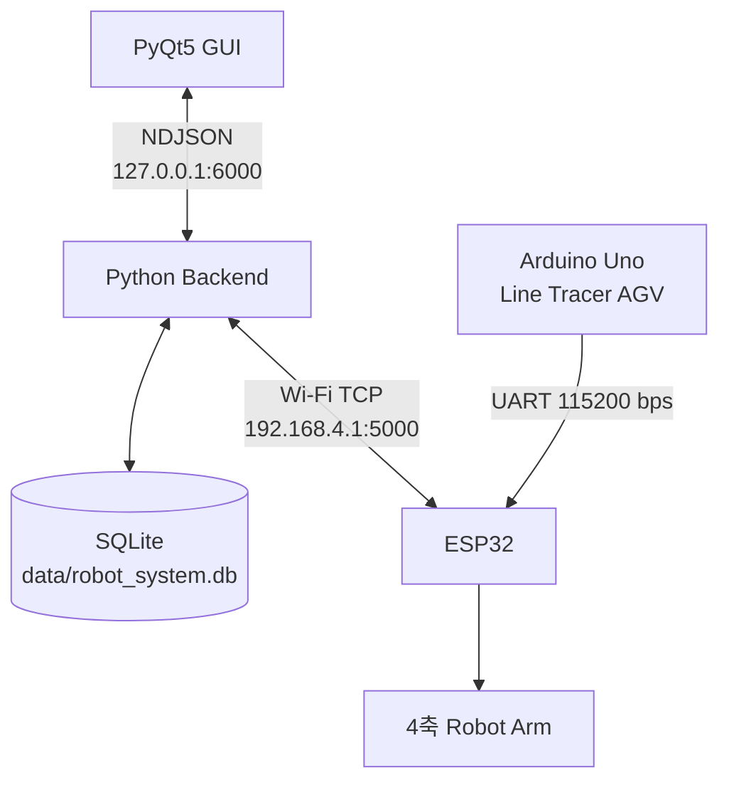

# RCcar — Robot Arm & AGV Integrated System

로봇팔과 자율주행 RC카(AGV)를 하나의 PC 애플리케이션에서 제어·관찰하고, Mission 단위로 동작 기록을 저장하는 통합 로봇 시스템입니다.

PC에서는 PyQt5 GUI와 별도 Python Backend가 실행됩니다. Backend는 ESP32와의 TCP 통신 및 SQLite 저장을 전담하고, ESP32는 로봇팔 서보 제어와 Arduino Uno의 AGV 텔레메트리 중계를 담당합니다.

## 시스템 구성



GUI는 ESP32와 데이터베이스에 직접 접근하지 않습니다. Backend 하나가 TCP 연결, 수신 메시지 분류, Mission 상태 및 SQLite 연결을 소유합니다.

## 주요 기능

### Robot Arm

- Base, Shoulder, Upper Arm, Fore Arm 4축 각도 제어
- Home 자세 `90,90,90,90`
- 수동 슬라이더 및 숫자 입력
- Teaching Position 저장·불러오기·실행
- 여러 Teaching Position으로 Action 구성 및 순차 실행
- ESP32 ACK 확인 후 다음 Action 단계 진행

### AGV

- 3채널 라인 센서를 이용한 라인 추종
- HC-SR04 초음파 센서를 이용한 장애물 정지
- 좌·우 엔코더 기반 RPM 추정
- 증분형 PID 속도 제어와 PWM 가감속
- 주기적으로 상태·거리·라인·RPM 보고

### Backend & Database

- GUI와 Backend 사이의 비동기 NDJSON 통신
- ARM ACK와 AGV 메시지를 하나의 ESP32 TCP 스트림에서 분리
- Mission 시작·종료 및 결과 관리
- 활성 Mission의 로봇팔 명령과 AGV 상태를 SQLite에 저장
- 잘못된 프로토콜 프레임을 연결 종료 없이 diagnostic으로 격리

## 저장소 구조

```text
RCcar/
├── backend/
│   ├── robot_backend.py       # GUI IPC, ESP32 연결, 요청 처리
│   ├── esp32_client.py        # ESP32 TCP 단일 수신 루프와 ARM ACK 처리
│   ├── parser.py              # NDJSON 및 ESP32 CSV 프로토콜 파서
│   └── mission_manager.py     # 현재 Mission과 저장 정책
├── database/
│   └── database.py            # SQLite 스키마, migration, 조회/저장
├── gui/
│   ├── robot_gui.py           # PyQt5 로봇팔 GUI
│   └── backend_client.py      # QThread 기반 Backend 클라이언트
├── firmware/
│   ├── robot_arm_esp32/
│   │   └── robot_arm_esp32.ino
│   └── archive/               # 과거 로봇팔 소스 보존본
├── ino/
│   ├── ino.ino                # Arduino Uno AGV 메인 펌웨어
│   └── modules/               # Wheel, 센서, 명령 모듈
├── tests/                     # Parser, DB, Backend 통합 테스트
├── tools/
│   └── fake_esp32_server.py   # 장비 없는 개발용 TCP 서버
├── pc/                        # 이전 PC 제어 코드
├── robotArm_tcp.py            # GUI 호환 실행 진입점
├── softAP_tcp.cpp             # 초기 ESP32 TCP 참고 코드
├── requirements.txt
└── README.md
```

`firmware/archive/`와 `pc/`, `softAP_tcp.cpp`는 참고·호환 목적으로 보존합니다. 현재 통합 실행에는 `backend/`, `gui/`, `database/`, `firmware/robot_arm_esp32/`, `ino/`를 사용합니다.

## 요구 사항

### PC

- Python 3.10 이상
- PyQt5 5.15 이상, 6 미만

### 펌웨어

- Arduino IDE 2.x 또는 Arduino CLI
- ESP32 Arduino Core
- Arduino AVR Boards Core
- ESP32에서 사용할 수 있는 `Servo.h` 호환 라이브러리
- Adafruit VL53L0X 라이브러리

Uno의 활성 거리 센서는 HC-SR04이지만 `ino/modules/ObstacleSensor.h`가 `Adafruit_VL53L0X.h`도 포함하므로 현재 소스를 빌드하려면 해당 라이브러리가 필요합니다.

## 설치

프로젝트 루트에서 Python 의존성을 설치합니다.

```powershell
python -m pip install -r requirements.txt
```

## 하드웨어 연결

### ESP32 Robot Arm

현재 `firmware/robot_arm_esp32/robot_arm_esp32.ino`의 ESP32 DevKit V1 핀 설정입니다.

| 역할 | ESP32 GPIO |
|---|---:|
| Base Servo | 18 |
| Shoulder Servo | 19 |
| Upper Arm Servo | 21 |
| Fore Arm Servo | 22 |
| Uno UART 수신 RX2 | 16 |
| Uno UART 송신 TX2 | 17 |

기본 네트워크 설정:

| 항목 | 기본값 |
|---|---|
| SoftAP SSID | `RobotArm_Team3` |
| SoftAP Password | `robot1234` |
| ESP32 IP | `192.168.4.1` |
| TCP Port | `5000` |

### Arduino Uno AGV

| 역할 | Uno 핀 |
|---|---:|
| 왼쪽 엔코더 | D2 |
| 오른쪽 엔코더 | D3 |
| 왼쪽 모터 입력 | D6 / D5 |
| 오른쪽 모터 입력 | D10 / D11 |
| 왼쪽 라인 센서 | D7 |
| 중앙 라인 센서 | D8 |
| 오른쪽 라인 센서 | D4 |
| HC-SR04 Trigger | D13 |
| HC-SR04 Echo | D12 |

Uno와 ESP32는 115200 bps UART로 연결합니다.

```text
Uno D1 TX ── level shifter/전압 분배 ──> ESP32 GPIO16 RX2
Uno D0 RX <──────────────────────────── ESP32 GPIO17 TX2
Uno GND   ───────────────────────────── ESP32 GND
```

Uno TX는 5V 논리이므로 ESP32 RX에 직접 연결하지 마십시오.

## 펌웨어 업로드

### 1. Arduino Uno AGV

`ino/ino.ino`를 Arduino Uno 대상으로 컴파일하고 업로드합니다.

```powershell
arduino-cli compile --fqbn arduino:avr:uno ino
arduino-cli upload --fqbn arduino:avr:uno -p <UNO_PORT> ino
```

부팅 후 라인 추종 모드가 자동으로 시작되며 AGV 상태를 115200 bps로 출력합니다.

### 2. ESP32 Robot Arm

`firmware/robot_arm_esp32/robot_arm_esp32.ino`를 ESP32 DevKit V1에 업로드합니다. 부팅 시 서보 네 축을 90도로 이동시키므로, 업로드 전에 Home 자세가 기구적으로 안전한지 확인해야 합니다.

ESP32는 다음 역할을 동시에 수행합니다.

- SoftAP 및 TCP 5000 서버 실행
- PC에서 받은 네 관절 각도 적용
- 명령마다 `ARM_ACK,OK` 또는 `ARM_ACK,ERROR` 반환
- Uno UART에서 받은 `AGV,...` 프레임을 TCP로 그대로 중계

## 실행 방법

### 실제 장비

1. Uno와 ESP32 펌웨어를 업로드합니다.
2. 모터·서보 전원 및 공통 GND를 확인합니다.
3. PC를 ESP32 Wi-Fi `RobotArm_Team3`에 연결합니다.
4. 프로젝트 루트에서 Backend를 실행합니다.

```powershell
python backend/robot_backend.py
```

5. 새 터미널에서 GUI를 실행합니다.

```powershell
python gui/robot_gui.py
```

기존 실행 파일도 같은 GUI를 시작합니다.

```powershell
python robotArm_tcp.py
```

6. GUI에서 ESP32 IP `192.168.4.1`, Port `5000`을 확인하고 **ESP32 연결**을 누릅니다.

Backend 기본 설정:

| 연결 | 기본값 |
|---|---|
| GUI → Backend | `127.0.0.1:6000` |
| Backend → ESP32 | `192.168.4.1:5000` |
| SQLite | `data/robot_system.db` |

Backend 주소나 DB 경로는 실행 옵션으로 변경할 수 있습니다.

```powershell
python backend/robot_backend.py --host 127.0.0.1 --port 6000 --db data/robot_system.db
```

GUI를 먼저 실행해도 Backend에 1초 간격으로 재연결합니다.

### GUI 사용 순서

1. **ESP32 연결** 상태를 확인합니다.
2. 처음에는 **Home**으로 네 관절의 안전한 방향을 확인합니다.
3. 슬라이더 또는 숫자 입력으로 각도를 설정하고 **현재 각도 ESP32로 전송**을 누릅니다.
4. 반복 사용할 자세는 Teaching Position으로 저장합니다.
5. 여러 Position을 Teaching Action에 추가해 순차 실행할 수 있습니다.
6. 기록이 필요하면 **Mission Start** 후 동작을 수행합니다.
7. 완료 시 `SUCCESS`, `FAILED`, `ABORTED` 중 결과를 선택하고 **Mission End**를 누릅니다.

Teaching Position과 Action 목록은 현재 GUI 메모리에만 유지되며 프로그램을 종료하면 사라집니다.

## 통신 프로토콜

### GUI ↔ Backend

UTF-8 JSON 한 줄과 줄바꿈을 사용하는 NDJSON 프로토콜입니다.

```json
{"type":"arm_command","command":"MOVE","angles":[90,120,80,100]}
```

지원하는 로봇팔 명령 종류는 `MOVE`, `HOME`, `TEACHING`, `ACTION`입니다. Backend는 명령 종류와 무관하게 ESP32에 네 각도만 전송합니다.

### Backend → ESP32

```text
base,shoulder,upper,forearm\n
```

각도는 정수 `0..180` 범위이며 순서는 Base, Shoulder, Upper Arm, Fore Arm입니다.

### ESP32 → Backend

```text
ARM_ACK,OK
ARM_ACK,ERROR
AGV,TRACING,245,0,1,0,89,87
AGV,OBSTACLE,110,0,1,0,0,0
AGV,STOP,110,0,1,0,0,0
AGV,DEST
```

일반 AGV 프레임 형식:

```text
AGV,<EVENT>,<DISTANCE_MM>,<LEFT_IR>,<CENTER_IR>,<RIGHT_IR>,<LEFT_RPM>,<RIGHT_RPM>
```

Backend가 현재 인식하는 AGV 이벤트는 `TRACING`, `OBSTACLE`, `STOP`, `DEST`입니다. `DEST`는 센서 필드 없이 단독 프레임으로 처리합니다.

## Mission과 데이터베이스

Backend는 시작 시 `data/robot_system.db`와 다음 테이블을 자동 생성합니다.

```text
mission(mission_id, start_time, end_time, result)
arm_log(mission_id, timestamp, command,
        base, shoulder, upper, forearm, ack)
agv_log(mission_id, timestamp, event, distance,
        left_ir, center_ir, right_ir, left_rpm, right_rpm)
```

저장 정책:

- Mission Start 시 새 `mission` 행 생성
- 활성 Mission 중 실제 전송된 로봇팔 명령만 `arm_log`에 저장
- ACK 성공은 `ack=1`, 오류·타임아웃은 `ack=0`
- 활성 Mission 중 수신한 AGV 프레임만 `agv_log`에 저장
- Mission 밖의 동작과 AGV 상태는 GUI에 전달하지만 DB에는 저장하지 않음
- Mission End 시 종료 시각과 선택한 결과 저장

## Uno 제어 설정

### 작업 주기

| 작업 | 주기 | 주파수 |
|---|---:|---:|
| 라인 센서·주행 정책 | 5ms | 200 Hz |
| 모터 출력 갱신 | 10ms | 100 Hz |
| 순간 RPM·PID 제어 | 20ms | 50 Hz |
| 평균 RPM 계산 | 100ms | 10 Hz |
| AGV 상태 전송 | 200ms | 5 Hz |
| 초음파 상태 머신 | 매 `loop()` | 측정 간격 60ms |
| 엔코더 | 펄스 발생 시 | 외부 인터럽트 |

### 기본값

| 설정 | 값 |
|---|---:|
| 직진 | 90 RPM |
| 완만한 회전 안쪽 / 바깥쪽 | 10 / 90 RPM |
| 급회전 안쪽 / 바깥쪽 | 0 / 60 RPM |
| 완만한 회전 → 급회전 | 600ms |
| 장애물 정지 거리 | 120mm |
| 엔코더 슬롯 | 20 |
| PID | P=0.55, I=2.5, D=0.1 |

RPM 추정기는 마지막 펄스 후 100ms까지 순간 RPM을 유지합니다. 이후 펄스가 없으면 시간 기반 상한으로 감쇠하며, 최소 300ms 또는 직전 펄스 간격의 2배가 지나면 0 RPM으로 판정합니다. 적응형 타임아웃은 최대 1초입니다.

## 장비 없이 테스트

터미널 1에서 가짜 ESP32 서버를 실행합니다.

```powershell
python tools/fake_esp32_server.py --port 5000 --mode sandwich
```

Backend와 GUI를 실행하고 GUI의 ESP32 IP를 `127.0.0.1`로 설정합니다.

Fake server 모드:

- `ack`
- `legacy`
- `agv-before-ack`
- `sandwich`
- `error`
- `timeout`

전체 자동 테스트:

```powershell
python -m unittest discover -s tests -v
```

## 현재 제한 사항

- GUI는 `agv_event`를 수신하지만 전용 AGV 대시보드는 아직 표시하지 않습니다.
- Backend는 `AGV,DEST`를 지원하지만 Uno에는 목적지 판정 로직이 없습니다.
- Uno 수동 모드는 `FORCEDRUN`, 비상정지는 `EMERGENCYSTOPPED`를 출력하지만 Backend parser는 현재 이 두 이벤트를 지원하지 않아 diagnostic으로 처리합니다.
- ESP32는 Uno 텔레메트리를 PC로 중계하지만 Backend에서 Uno로 명령을 보내는 경로는 구현되지 않았습니다.
- ARM wire protocol에 request ID가 없어 한 번에 하나의 명령만 ACK 대기 상태가 될 수 있습니다.
- `firmware/archive/arms_20260819_original.ino`는 복원된 참고 소스이며 그대로 업로드하면 안 됩니다.

## 안전 주의 사항

- 서보 4개는 ESP32 보드에서 직접 급전하지 말고 별도 5V 전원을 사용하십시오. 최소 4A, 가능하면 5A 이상을 권장합니다.
- 서보 외부 전원, ESP32, Uno, 모터 드라이버의 GND를 공통으로 연결하십시오.
- 모터는 Uno 핀에서 직접 구동하지 말고 모터 드라이버를 사용하십시오.
- 처음 업로드하거나 PID·속도를 변경한 뒤에는 AGV 바퀴를 지면에서 띄운 상태로 확인하십시오.
- 로봇팔은 90도 Home 자세와 관절 방향을 확인한 후 작은 각도 변화부터 시험하십시오.
- 소프트웨어 정지만 의존하지 말고 모터와 서보 전원을 물리적으로 차단할 수단을 마련하십시오.

## 라이선스

이 프로젝트는 [MIT License](./LICENSE)를 따릅니다.
